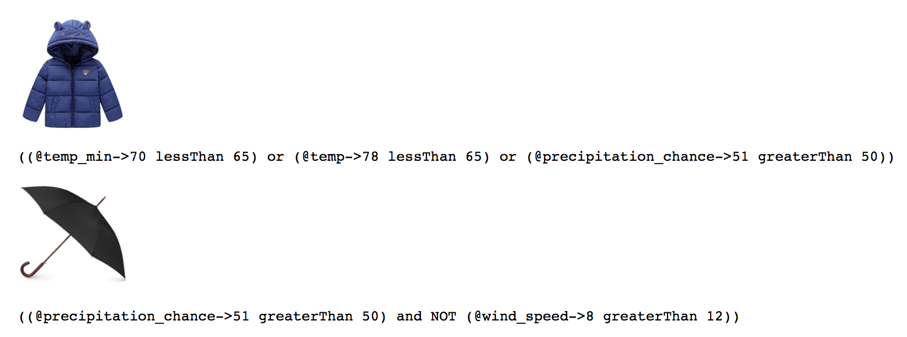

# Regent Weather App

This project exists as a simple example of configuring an application's business logic with [regent](https://github.com/northwesternmutual/regent).

View the [live demo](http://weather.eisenberg.ninja/).

This application was inspired by the examples I used in a MKEJS tech talk. Here are the [slides from that talk](http://regent.eisenberg.ninja/).

The two important files are `rules.js` and `clothing-logic.js`.

## rules.js

`rules.js` is where we define our rules. Basically we are naming different data conditions. For example, we define `windy` as the data key `wind_speed` being greater than 12.

We also have composed rules. These rules allow us to build more complex logical conditions. For example, our application will suggest you bring an umbrella (`shouldBringAnUmbrella`) when there is a high chance of rain, and it is not windy (because umbrellas are a burden when it is windy).

If you want more information check out the [how rules work](https://github.com/northwesternmutual/regent#how-rules-work) regent documentation.

```javascript
import { or, not, and } from 'regent'

// These are our low level rules (atoms)
export const coldEnoughForCoatRightNow = { left: '@temp', fn: 'lessThan', right: 65 }
export const coldEnoughForCoatInFuture = { left: '@temp_min', fn: 'lessThan', right: 65 }
export const highChanceOfRain = { left: '@precipitation_chance', fn: 'greaterThan', right: 50 }
export const windy = { left: '@wind_speed', fn: 'greaterThan', right: 12 }
export const notWindy = not(windy)
export const cloudy = { left: ['Partly Cloudy', 'Cloudy'], fn: 'includes', right: '@weather' }

// These are our composed rules (molecules)
export const shouldWearACoat = or(coldEnoughForCoatInFuture, coldEnoughForCoatRightNow, highChanceOfRain)
export const shouldBringAnUmbrella = and(highChanceOfRain, notWindy)
export const shouldBringSunglasses = not(cloudy)

```

## clothing-logic.js

Our clothing logic file is where we associate the rules we defined in `rules.js` with some real application data, in this example, and image of the item we want to display. Each item in the images array has a `rule` property, and each of those properties have a value that is a single regent rule.

Regent provides `find` and `filter` as methods to help you search through a logic table. In this example we are using `filter` which will return an array containing every array item that has a true `rule`.

We are also exporting a curried function named `filterImages` that has `regent.filter` and this logic table bound to it already. It only needs a data object to return our list of images. This is a pattern I personally like, because I think it simplifies your implementation.

For more information check out [querying logic tables](https://github.com/northwesternmutual/regent#querying-logic-tables) in the regent documentation.

```javascript
import { shouldWearACoat, shouldBringSunglasses, shouldBringAnUmbrella } from "./rules";
import _ from 'lodash'
import { filter } from 'regent'

const images = [
  { src: 'https://images-na.ssl-images-amazon.com/images/I/61wJrHgEj9L._SX385_.jpg', rule: shouldWearACoat },
  { src: 'https://i.warbycdn.com/-/p/men-robinson-sunglasses-jet-black-matte-angle-871-d407a730/1200x630', rule: shouldBringSunglasses },
  { src: 'https://images-na.ssl-images-amazon.com/images/I/71md9jHDSgL._SL1500_.jpg', rule: shouldBringAnUmbrella },
]

export const filterImages = _.curry(filter)(images)

export default images
```

## App.js

Now we can focus on rendering the images in our application. Luckily that is super easy now.

```javascript
import { filterImages } from './clothing-logic'

// Defining a react component

{ filterImages(this.state).map(img => (
  <div key={img.src}>
    
    <pre>
      {explain(img.rule, this.state)}
    </pre>
  </div>
)) }
```

When we call `filterImages` with data we get back an array of all truthy logic rows. We are mapping over that array and rendering an image for each one, setting the `src` prop equal to the `src` key from our logic table.

Below the image we are printing out the result of [regent.explain](https://github.com/northwesternmutual/regent#explain) in a `pre` tag. `regent.explain` prints out the logic of a regent rule in human readable form, making it easy to debug.



# Development

This project is built on `create-react-app` so it's a pretty standard local setup.

```
git clone https://github.com/eisenivan/regent-weather-app.git
cd regent-weather-app
npm i
npm run start
```
